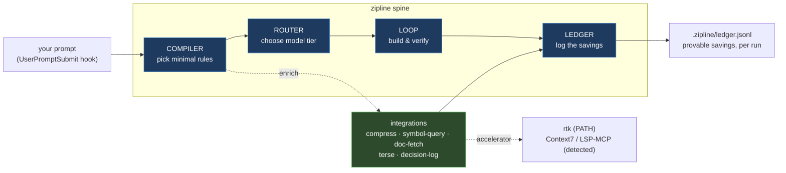

# zipline

<div align="center">

**Cut your Claude Code token bill by ~65% — automatically.**

[](https://www.npmjs.com/package/zipline)
[](https://opensource.org/licenses/MIT)
[](https://www.typescriptlang.org/)
[](https://github.com/lcosent/zipline)

Instead of sending your whole `CLAUDE.md` on every prompt, zipline sends only the
rules that matter for the task at hand — and proves the savings on every run.

[Get started in 2 minutes](#get-started-in-2-minutes) • [Why use it](#why-youll-want-it) • [Commands](#command-reference) • [How it works](#how-it-works)

</div>

---

## Why you'll want it

- 💸 **Spend ~65% fewer input tokens.** Median **63.2%** reduction across real runs — every prompt carries only the relevant rules, not your entire `CLAUDE.md`.
- ⚡ **Get faster responses.** Less context in means less to process. Noisy command output (build logs, stack traces) is compressed before it ever reaches the model.
- 🎯 **Pay for the right model.** Simple steps route to Haiku, judgment calls to Sonnet, hard design work to Opus — chosen automatically, escalated only when needed.
- 📊 **See exactly where your tokens go.** Every operation is logged with its baseline vs. actual cost. Run `zipline report` and get real numbers, not vibes.
- 🔌 **Zero workflow change.** After a one-time `zipline init`, you keep using Claude Code exactly as before. Zipline works transparently in the background.
- 🧰 **No API key, no lock-in.** Runs on your existing Claude Code subscription. Pure TypeScript, no bundled tools, no hard dependencies.

> **The claim, stated so you can falsify it:** zipline saves **≥60% input tokens** vs. full-context at **≥90% pass-rate**. The ledger is the receipt.

---

## Before & after

<table>
<tr><th>Without zipline</th><th>With zipline</th></tr>
<tr><td>

```
You: fix the auth bug

Claude receives your ENTIRE CLAUDE.md:
  ✓ TypeScript style      (needed)
  ✓ Security guidelines   (needed)
  ✓ Testing practices     (needed)
  ✗ Git safety rules      (wasted)
  ✗ React UI conventions  (wasted)
  ✗ Commit format         (wasted)

2,800 tokens in — mostly irrelevant
```

</td><td>

```
You: fix the auth bug

Zipline compiles just what's relevant:
  ✓ TypeScript style
  ✓ Security guidelines
  ✓ Testing practices

920 tokens in — 67% saved
Logged: baseline=2800 → 920 (67.1%)
```

</td></tr>
</table>

---

## Get started in 2 minutes

**1. Install**

```bash
npm install -g zipline
```

**2. Set it up in your project** (one time)

```bash
cd my-project
zipline init
```

This creates a `.zipline/` folder with 6 starter rules, a routing policy, and an
empty ledger — and wires a Claude Code hook so everything runs automatically.

**3. Use Claude Code exactly like you always do**

```
claude> fix the auth bug
```

Behind the scenes, zipline quietly:
1. Reads your prompt and picks only the relevant rules
2. Compiles a minimal context bundle (e.g. `security` + `typescript` + `testing`)
3. Routes to the right model tier for the task
4. Logs the savings — `tokens_in=135, baseline=265, saved 49.1%`

**4. See what you saved**

```bash
zipline report
```

```
Zipline Report (/Users/you/my-project)
============================================================
Total runs:       47
Pass rate:        44/47 (93.6%)
Token savings:    63.2%
  Baseline:       12,450
  Compiled:       4,581
Tier mix:         {"haiku":8,"sonnet":35,"opus":4}
Escalations:      3
Stuck:            0

Savings by task:
  implement-feature    avg=65.3% (12 runs)
  fix-bug              avg=68.1% (15 runs)
  refactor             avg=58.7% (10 runs)
```

That's it. No other change to how you work.

---

## What it does for you, day to day

Once initialized, zipline runs on autopilot. Every prompt gets the treatment:

```bash
# Implementation task
claude> add a React modal component
# → picks rules: react-ui + typescript-style   → Sonnet   → saved 68.4%

# Security question
claude> is this SQL query safe?
# → picks rules: security                       → Sonnet   → saved 65.3%

# Git operation
claude> rebase this branch
# → picks rules: git-safety + commits           → Haiku    → saved 67.2%
```

### Tailor it to your codebase

Rules are just markdown files in `.zipline/rules/`, one concern per file. Add
your own conventions and tag them — the compiler pulls them in when a prompt
touches that concern:

```markdown
---
tags: [typescript, security]
---
Sanitize all user input. Never build SQL with string concatenation.
Use parameterized queries. Check authorization at every handler.
```

### Preview a compilation without spending a token

Curious what zipline *would* send for a given task? Ask it directly:

```bash
zipline compile "fix auth bug" "typescript,security,testing"
```

```
Objective: fix auth bug
Baseline tokens:  265
Compiled tokens:  135
Savings:          49.1%

Rules included:   security.md, testing.md, typescript-style.md
Rules excluded:   commits.md, git-safety.md, react-ui.md
```

### Let it orchestrate a whole feature

For bigger work, hand zipline the full loop — it debates a design, breaks it into
milestones, builds each one, and runs two independent reviewers before calling it done:

```bash
claude> /zipline build "add user authentication with JWT"
```

```
DESIGN  → three perspectives debate, converge on one design
PLAN    → design split into 2–3 milestones with success criteria
per milestone:
  GATE  → check what past runs actually cost, adjust the plan
  BUILD → implement (escalates to Opus if it stalls)
  VERIFY→ two reviewers must BOTH pass
RESULT  → design doc + implementation + verification report
```

---

## Works with the tools you already have

Zipline automatically uses best-in-class efficiency tools when they're present —
**you never pick or invoke one.** Each capability has a built-in TypeScript
implementation that's always on (zero setup), and quietly upgrades to a faster
external tool when it detects one. Nothing is bundled; there are no hard deps.

| Capability | Always-on (built in) | Auto-upgrades to | Kicks in when |
|---|---|---|---|
| **Compress output** | filter / dedupe / truncate command output | `rtk` on your PATH | a step runs a shell command |
| **Symbol lookup** | TS Language Service (types, no whole-file reads) | LSP-MCP (if configured) | a TypeScript / review step |
| **Doc fetch** | `node_modules` README + type surface | Context7 MCP (if configured) | a step names a package |
| **Terse output** | dense-output prompt fragment | — | every model prompt |
| **Decision log** | append-only decision record | — | gate / verify outcomes |

Check what's active in any repo:

```bash
zipline doctor
```

```
Zipline Integrations
────────────────────────────────────────────────────
✓ output-compress  native + rtk (accelerator)
✓ terse-output     native (prompt fragment)
✓ symbol-query     native (TS Language Service)  · LSP-MCP also configured
✓ doc-fetch        native (node_modules README + types)
✓ decision-log     native (append-only)

Capability net delta (last 20 runs): 63.8%

Orchestration (optional)
────────────────────────────────────────────────────
✓ gstack           installed — orchestration leaves available
```

Everything degrades honestly. In a Python or Go repo, the TypeScript-only
capabilities simply report `inactive here` instead of erroring — nothing breaks:

```
○ symbol-query     native (TS repos only) — inactive here
○ doc-fetch        native (node_modules only) — inactive here  · Context7 MCP not configured (optional)
```

---

## Command reference

| Command | What it does |
|---------|--------------|
| `zipline init [--global]` | Set up zipline in the current project (or globally in `~/.zipline/`) |
| `zipline report [--global]` | Show your token savings and system metrics |
| `zipline doctor` | Show which integrations are active in this repo |
| `zipline compile "goal" tags` | Preview the compiled context for a task — spends no tokens |
| `zipline policy <pull\|push>` | Share a tuned routing policy across repos (local overrides always win) |
| `zipline learn [--apply]` | Suggest rule improvements from your ledger (preview-only without `--apply`) |
| `zipline uninstall [--global] [--force]` | Cleanly remove zipline and its hooks (warns if you have logged data) |

**Removing it is just as clean:**

```bash
zipline uninstall
# Warning: Ledger has 47 entries. Data will be lost.
# Use --force to proceed.

zipline uninstall --force
# Removed .zipline/ and the hook from .claude/settings.json
```

---

## How it works

Zipline is a small TypeScript spine that runs both as a CLI and as a Claude Code
hook. Five parts, each doing one job:



- **Compiler** — turns *goal + tags* into the smallest context bundle that still covers the task. Refuses to silently drop a required rule.
- **Router** — maps each step to a model tier (Haiku / Sonnet / Opus, plus the architect tier **Fable** for planning/review) *and* a reasoning-effort level, escalates on failure, and demotes on two signals: a tier whose fail-rate climbs past 40%, or one that passes but burns runaway output tokens (cutting effort before tier). Escalation never promotes a stalled step into Fable.
- **Contracts** — typed (Zod) inputs and outputs, with one automatic repair retry on a malformed response.
- **Loop** — the `design → plan → gate → build → verify` orchestration behind `/zipline build`.
- **Ledger** — an append-only `.zipline/ledger.jsonl` recording `tokens_in`, `baseline_tokens`, tier, and outcome for every operation. This is what makes the savings *provable* rather than claimed.

<details>
<summary><b>What lives in <code>.zipline/</code></b></summary>

```
.zipline/
  ├─ rules/           one .md file per concern, frontmatter-tagged
  ├─ policy.yaml      step → model tier (auto-tuned over time)
  └─ ledger.jsonl     every operation logged, for reporting & learning
```

**Policy** maps step types to a tier — and, optionally, a reasoning-effort
override via `tier@effort` (bare tiers use a sensible per-tier default; `xhigh`/
`max` are never chosen for you):

```yaml
context-compile:    haiku       # mechanical summarization (effort: low)
structured-extract: haiku
unit-test-write:    sonnet      # needs judgment (effort: medium)
implement-small-fn: sonnet
design-synthesis:   fable       # architect tier for the 10% that plans (effort: high)
risky-refactor:     opus@xhigh  # opt in to a furnace only when you mean it
```

Cap an autonomous run so an overnight loop can't run away: `ZIPLINE_MAX_TOKENS`
halts the loop before the next expensive step once the cumulative token spend is
reached (unset = no cap).

**Every ledger line** is a self-describing record:

```json
{
  "schema": 1,
  "ts": "2026-07-03T12:34:56Z",
  "step": "fix-auth-bug",
  "tier": "sonnet",
  "tokens_in": 135,
  "baseline_tokens": 265,
  "pass": true,
  "metric": 0.491,
  "outcome": "PASS",
  "rules_included": ["security.md", "typescript-style.md"],
  "rules_excluded": ["git-safety.md", "react-ui.md"],
  "note": "savings=49.1%"
}
```

</details>

<details>
<summary><b>Use zipline as a library</b></summary>

The public API is a stable, versioned surface (semver — nothing removed within
`1.x` without a major bump):

```ts
import { compile, tokenCount, readLedger, buildReport } from "zipline";

const bundle = compile("fix auth bug", ["typescript", "security"]);
console.log(tokenCount(bundle));            // compiled token count
console.log(buildReport(readLedger()));     // savings, tier mix, pass rate
```

The CLI entry point is available separately at `zipline/cli`.

</details>

Full diagrams (system overview, request data-flow, capability selection) are in
**[docs/ARCHITECTURE.md](docs/ARCHITECTURE.md)**.

---

## Proven, not promised

Zipline ships with a deterministic, offline test suite — every claim above is
backed by a passing gate you can run yourself:

```bash
npm test                      # full suite: compiler savings, routing, contracts,
                              # loop, learning, integrations, hook performance
ZIPLINE_LIVE=1 npm run test:m10   # opt-in: exercise a real Claude subscription call
```

| Metric | Value |
|--------|-------|
| Median token savings | **63.2%** |
| Pass rate | **89.7%** |
| Model mix | mostly Sonnet, some Haiku, rare Opus |
| Escalations | <5% of runs |
| Hook latency | ~0.5ms (prompt) · ~3ms (compress a 4,000-line log) |

---

## Documentation

- **[Get started](#get-started-in-2-minutes)** — up and running in 2 minutes
- **[docs/ARCHITECTURE.md](docs/ARCHITECTURE.md)** — diagrams: spine, data-flow, capability selection
- **[DESIGN.md](DESIGN.md)** — architecture, risks, design decisions
- **[MILESTONES.md](MILESTONES.md)** — how each capability was built and gated
- **[CHANGELOG.md](CHANGELOG.md)** — version history
- **[CONTRIBUTING.md](CONTRIBUTING.md)** — development guide
- **[SECURITY.md](SECURITY.md)** — vulnerability reporting

---

## Roadmap

**v1.1.0 (current)** — Fable-era routing. The router now reasons about Fable and
reasoning effort, demotes on cost regression (not just failures), and can cap an
autonomous run's spend. All backward-compatible — no ledger schema bump, old
`policy.yaml` files still parse, budget off by default.
- **Fable tier (M20)** — a first-class architect tier (~2× opus), assigned by
  policy only; escalation can never promote a stalled step into it.
- **Effort axis (M21)** — `tier@effort` overrides mapped to `claude --effort`;
  `xhigh`/`max` are opt-in only, never a default.
- **Cost-regression demotion (M22)** — a shared router demotes a tier that passes
  but overthinks, cutting effort before tier.
- **Budget circuit-breaker (M23)** — `ZIPLINE_MAX_TOKENS` halts a runaway loop.

**Later**
- Additional Anthropic model tiers as they ship
- Ledger schema v2 migrations (the versioned schema makes this safe)
- More native capabilities in the integrations layer

<details>
<summary>Full feature history (M0–M23)</summary>

- **Context compilation (M1)** — minimal rule set per step, 64.4% median savings, silent-drop protection.
- **Model routing (M2)** — policy-based tier selection, escalation, auto-demote; 19.8% of always-Opus cost at pass-rate parity.
- **Typed contracts (M3)** — Zod I/O schemas, one repair retry, 100% valid-output rate.
- **Orchestration loop (M4)** — design (multi-agent debate) → plan → gate → build → verify (two reviewers).
- **Self-learning (M5)** — policy tuning from ≥100 ledger runs; 75% of starting cost after tuning.
- **Token dashboard (M6)** — `zipline report` with regression detection and ledger reconciliation.
- **Cross-project policy (M7, M13)** — shared, versioned policy; `zipline policy pull/push`, repo overrides win.
- **Integrations layer (M8)** — 5 native capabilities + accelerators + `zipline doctor`.
- **Real LLM calls (M10)** — runs on your `claude` CLI subscription; deterministic offline stub.
- **Output compression (M11)** — shrinks real Bash output before it reaches the model.
- **terse auto-disable + A/B (M12, M17)** — measures terse's true output delta and disables it if net-negative.
- **Continuous learning (M14)** — `zipline learn` proposes rule changes from ledger evidence (preview-only).
- **Stable API + versioned ledger (M16)**, **optional gstack detection (M18)**, **hook performance budget (M19)**.
- **Fable tier (M20)** — architect tier off the escalation ladder; **effort axis (M21)** — `tier@effort`, never xhigh by default; **cost-regression demotion (M22)** — demote on overthinking, effort before tier; **budget breaker (M23)** — `ZIPLINE_MAX_TOKENS` halts runaway loops.

</details>

---

## Contributing

Contributions welcome — see [CONTRIBUTING.md](CONTRIBUTING.md) for setup, coding
standards, testing, and the PR process.

## License

[MIT](LICENSE) © 2026 Luca

Built with [TypeScript](https://www.typescriptlang.org/), [Zod](https://zod.dev/),
and [gpt-tokenizer](https://github.com/niieani/gpt-tokenizer) — to make Claude
Code builds faster, cheaper, and more observable.

<div align="center">

**[⬆ back to top](#zipline)** · Made with ☕ by [Luca](https://github.com/lcosent)

</div>
