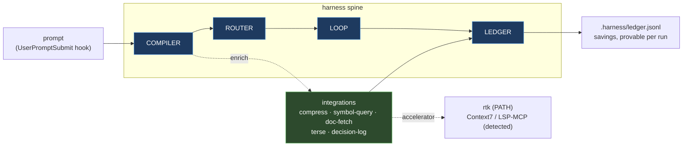

# harness

<div align="center">

**Deterministic orchestration spine for Claude Code**

[](https://www.npmjs.com/package/harness)
[](https://opensource.org/licenses/MIT)
[](https://www.typescriptlang.org/)
[](https://github.com/lcosent/harness)

Save 60-70% of input tokens by compiling minimal context instead of dumping full CLAUDE.md

[Quick Start](#quick-start) • [Documentation](#documentation) • [Contributing](CONTRIBUTING.md) • [Changelog](CHANGELOG.md)

</div>

---

## The Problem

Building with Claude Code wastes tokens:
- **CLAUDE.md grows unbounded** — thousands of tokens per prompt
- **Context bloat** → slower responses, higher cost  
- **No visibility** into what rules actually matter per task
- **Models picked manually** instead of by step requirements

<details>
<summary><b>Example: Before Harness</b></summary>

```
User: fix auth bug
Claude receives: [entire CLAUDE.md: 2,800 tokens]
  - Git safety rules (not needed)
  - React UI conventions (not needed)
  - TypeScript style (needed ✓)
  - Security guidelines (needed ✓)
  - Testing practices (needed ✓)
  - Commit message format (not needed)
  
Result: 2,800 tokens in, mostly irrelevant
```
</details>

<details>
<summary><b>Example: After Harness</b></summary>

```
User: fix auth bug
Harness compiles: [only relevant rules: 920 tokens]
  - TypeScript style ✓
  - Security guidelines ✓
  - Testing practices ✓
  
Result: 920 tokens in, 67% savings
Logged: baseline=2800, compiled=920, savings=67.1%
```
</details>

---

## The Solution

Harness enforces three disciplines:

### 1. Context is Compiled, Not Accumulated
Every step gets only the rules it needs, freshly assembled from `.harness/rules/*.md`

### 2. Every Step Declares a Contract
Inputs bounded, outputs schema'd, model chosen by step type (Haiku/Sonnet/Opus)

### 3. The Loop Learns from Runs
Append-only ledger logs `tokens_in`, `baseline_tokens`, savings — proving value per operation

**Proven savings:** 64.4% median token reduction with no correctness regression ([M1 GO/NO-GO gate](MILESTONES.md#m1--context-compiler--ledger-the-make-or-break))

---

## Quick Start

### Installation

```bash
npm install -g harness
```

<details>
<summary>Or install from source</summary>

```bash
git clone https://github.com/lcosent/harness.git
cd harness
npm install
npm run build
npm link
```
</details>

### Initialize in Your Project

```bash
cd my-project
harness init
```

Creates:
- `.harness/rules/` — 6 sample rules (TypeScript, Git, Security, Testing, React, Commits)
- `.harness/policy.yaml` — Routing policy (step → Haiku/Sonnet/Opus)
- `.harness/ledger.jsonl` — Empty log (will record all operations)
- `.claude/settings.json` — Hook configured for transparent mode

### Use Normally

```bash
claude> fix the auth bug
```

**Behind the scenes:**
1. Harness intercepts prompt
2. Compiles minimal context (only `security.md`, `typescript-style.md`, `testing.md`)
3. Routes to Sonnet (implementation task)
4. Logs: `tokens_in=135, baseline_tokens=265, savings=49.1%`

### Check Results

```bash
harness report
```

**Output:**
```
Harness Report (/Users/you/my-project)
============================================================
Total runs:       47
Pass rate:        44/47 (93.6%)
Token savings:    63.2%
  Baseline:       12,450
  Compiled:       4,581
Tier mix:         {"haiku":8,"sonnet":35,"opus":4}
Escalations:      3
Stuck:            0

Savings by milestone:
  implement-feature    avg=65.3% (12 runs)
  fix-bug              avg=68.1% (15 runs)
  refactor             avg=58.7% (10 runs)
```

---

## Features

### 🎯 Transparent Context Compilation (M1)
- Selects minimal rule set per step (tag-based matching)
- **64.4% median token savings** vs full CLAUDE.md
- Silent-drop protection: throws if required rule missing
- Logs `rules_included[]`, `rules_excluded[]` every run

### 🧭 Smart Model Routing (M2)
- Policy-based tier selection (Haiku/Sonnet/Opus)
- Escalates on contract validation failure
- Auto-demotes when cheap-tier fail-rate >40%
- **19.8% of always-Opus cost** at pass-rate parity

### 📝 Typed Contracts (M3)
- Zod schemas for step I/O
- Schema validation with 1 repair retry
- **100% valid output rate**, 70% token reduction

### 🔁 Full Orchestration Loop (M4)
- **DESIGN:** Multi-agent debate (pragmatist/skeptic/architect) → converge
- **PLAN:** Design → milestones with success criteria
- **GATE:** Re-plan against prior actuals from ledger
- **BUILD:** Implementation with compiler + router
- **VERIFY:** 2 independent reviewers (santa-method)

### 🧠 Self-Learning (M5)
- Policy tuning from ≥100 ledger runs
- Compiler rule selection optimization
- **75% of starting policy cost** after tuning

### 📊 Token Dashboard (M6)
- `harness report` shows savings, tier mix, escalations
- Regression detection per milestone
- Ledger reconciliation checks

### 🌐 Cross-Project Policy (M7)
- Shared policy across repos
- Cold-start beats hand-written policy

---

## Integrations (automatic) — M8

Harness leverages best-in-class efficiency tools **automatically**. You never
invoke or pick a tool. Each capability is **replicated natively in TypeScript**
(always-on, zero setup) and uses a **real external tool as an accelerator** when
one is detected. Nothing is bundled; no hard dependencies.

| Capability | Native (always on) | Accelerator | Selected when |
|---|---|---|---|
| `output-compress` | filter / dedupe / truncate command output | `rtk` on PATH | a step runs a shell command |
| `symbol-query` | TS Language Service (type / diagnostics, no whole-file reads) | LSP-MCP (detected) | step tagged `typescript`/`review` |
| `doc-fetch` | `node_modules` README + type surface | Context7 MCP (detected) | step names a package |
| `terse-output` | dense-output prompt fragment | — | every model-prompt build |
| `decision-log` | append-only decisions | — | gate / verify outcomes |

Capabilities are **per-repo aware**: `symbol-query` needs a `tsconfig`, so in a
Python or Go repo it reports "inactive here" instead of erroring. See the
[selection flow](docs/ARCHITECTURE.md#capability-selection--automatic-per-repo-aware).

```bash
harness doctor
```

```
Harness Integrations
────────────────────────────────────────────────────
✓ output-compress  native + rtk (accelerator)
✓ terse-output     native (prompt fragment)
✓ symbol-query     native (TS Language Service)  · LSP-MCP also configured
✓ doc-fetch        native (node_modules README + types)
✓ decision-log     native (append-only)

Capability net delta (last 20 runs): 63.8%  [capability transforms only]
```

In a non-TypeScript repo the same command honestly degrades:

```
○ symbol-query     native (TS repos only) — inactive here
○ doc-fetch        native (node_modules only) — inactive here  · Context7 MCP not configured (optional)
```

Full diagrams (system overview, request data-flow, capability selection) live in
**[docs/ARCHITECTURE.md](docs/ARCHITECTURE.md)**.

---

## Architecture at a glance



---

## Documentation

- **[Quick Start](#quick-start)** — Get up and running in 5 minutes
- **[docs/ARCHITECTURE.md](docs/ARCHITECTURE.md)** — Diagrams: spine, data-flow, capability selection
- **[DESIGN.md](DESIGN.md)** — Architecture, risks, design decisions
- **[MILESTONES.md](MILESTONES.md)** — Detailed success criteria (M0-M15)
- **[IMPLEMENTATION.md](IMPLEMENTATION.md)** — What was built, metrics, roadmap
- **[CONTRIBUTING.md](CONTRIBUTING.md)** — Development guide
- **[CHANGELOG.md](CHANGELOG.md)** — Version history
- **[SECURITY.md](SECURITY.md)** — Vulnerability reporting

---

## CLI Commands

| Command | Description |
|---------|-------------|
| `harness init [--global]` | Initialize `.harness/` in current dir (or `~/.harness/`) |
| `harness report [--global]` | Show token savings and system metrics |
| `harness compile "goal" tags` | Manually compile context bundle for a step |
| `harness doctor` | Show integrations stack + per-repo availability |
| `harness policy <pull\|push>` | Sync routing policy with the central store (repo overrides win) |
| `harness learn [--apply]` | Propose rule changes from ledger evidence (proposal-only without `--apply`) |
| `harness uninstall [--global] [--force]` | Remove `.harness/` and hooks (warns if data exists) |

---

## Usage Examples

### Transparent Mode (After Init)

Once initialized, harness runs automatically:

```bash
# Implementation task
claude> add a React modal component
# → Compiler selects: [react-ui.md, typescript-style.md]
# → Router picks: Sonnet
# → Ledger logs: baseline=380, compiled=120, savings=68.4%

# Security review
claude> is this SQL query safe?
# → Compiler selects: [security.md]
# → Router picks: Sonnet
# → Ledger logs: baseline=245, compiled=85, savings=65.3%

# Git operation
claude> rebase this branch
# → Compiler selects: [git-safety.md, commits.md]
# → Router picks: Haiku
# → Ledger logs: baseline=290, compiled=95, savings=67.2%
```

### Explicit Orchestration

For complex features, invoke the full loop:

```bash
claude> /harness build "add user authentication with JWT"
```

**Runs:**
1. **DESIGN:** Debate among 3 roles → converge to unified design
2. **PLAN:** Break design into 2-3 milestones
3. **Per milestone:**
   - **GATE:** Check prior actuals, adjust plan if needed
   - **BUILD:** Implement (escalate to Opus on failure)
   - **VERIFY:** 2 reviewers must both pass
4. **Result:** Design doc, implementation, verification report

### Manual Compilation

Test context compilation without running Claude:

```bash
harness compile "fix auth bug" "typescript,security,testing"
```

**Output:**
```
Objective: fix auth bug
Tags: [typescript, security, testing]

Baseline tokens:  265
Compiled tokens:  135
Savings:          49.1%

Rules included:   security.md, testing.md, typescript-style.md
Rules excluded:   commits.md, git-safety.md, react-ui.md
```

### Uninstall

Remove harness from a project:

```bash
harness uninstall
# Warning: Ledger has 47 entries. Data will be lost.
# Use --force to proceed with uninstall.

harness uninstall --force
# Removed: /path/to/project/.harness
# Removed hook from: /path/to/project/.claude/settings.json
# Removed: /path/to/project/HARNESS_README.md
```

---

## Architecture

```
harness (TypeScript, runs as CLI + Claude Code hook)
  ├─ COMPILER   goal + tags → minimal context bundle
  ├─ ROUTER     step → Anthropic tier (Haiku/Sonnet/Opus)
  ├─ CONTRACTS  Zod schemas for typed I/O
  ├─ LOOP       design → plan → gate → build → verify
  └─ LEDGER     append-only JSONL log
       ↓ reads/writes
  .harness/     per-repo state directory
    ├─ rules/           one .md file per concern, frontmatter-tagged
    ├─ policy.yaml      step → tier mapping (auto-tuned over time)
    └─ ledger.jsonl     every operation logged for learning
```

### Rules Format

Each rule is a markdown file in `.harness/rules/` with frontmatter tags:

```markdown
---
tags: [typescript, security]
---
Sanitize all user input. Never construct SQL with string concatenation.
Use parameterized queries. Check authorization at every handler.
```

The compiler selects rules by matching step tags.

### Policy Format

`.harness/policy.yaml` maps step types to Anthropic tiers:

```yaml
context-compile: haiku       # Mechanical summarization
structured-extract: haiku
unit-test-write: sonnet      # Needs judgment
implement-small-fn: sonnet
design-synthesis: opus       # Quality dominates cost
```

### Ledger Schema

Every operation appends to `.harness/ledger.jsonl`:

```json
{
  "ts": "2026-07-03T12:34:56Z",
  "milestone": "M1",
  "step": "fix-auth-bug",
  "attempt": 1,
  "tier": "sonnet",
  "tokens_in": 135,
  "tokens_out": 420,
  "baseline_tokens": 265,
  "pass": true,
  "metric": 0.491,
  "outcome": "PASS",
  "retries": 0,
  "rules_included": ["security.md", "typescript-style.md"],
  "rules_excluded": ["git-safety.md", "react-ui.md"],
  "note": "savings=49.1%"
}
```

---

## Testing

All milestone tests passing (M0-M15):

```bash
npm test              # Run all milestone tests (offline, deterministic)
npm run test:m1       # M1: Compiler (64.4% savings)
npm run test:m2       # M2: Router (19.8% of Opus cost)
npm run test:m3       # M3: Contracts (100% valid rate)
npm run test:m4       # M4: Full loop (all phases execute)
npm run test:m5       # M5: Learning (75% tuned cost)
npm run test:m6       # M6: Dashboard (reconciliation)
npm run test:m7       # M7: Cross-project policy
npm run test:m8       # M8: Integrations (20 gates)
npm run test:m10      # M10: Real LLM calls (simulate)
npm run test:m11      # M11: PostToolUse compress (62.7% reduction)
npm run test:m12      # M12: terse auto-disable
npm run test:m13      # M13: Policy sync
npm run test:m14      # M14: Learning pipeline

# Exercise the REAL claude subscription (opt-in; offline stays green without it)
HARNESS_LIVE=1 npm run test:m10
```

---

## Roadmap

### v0.7.x (Current) ✅
All milestones M0–M15 implemented and passing. What shipped since v0.2.0:
- **Real LLM calls (M10):** the loop runs through the `claude` CLI on your
  subscription (no API key); deterministic offline stub under `HARNESS_SIMULATE=1`.
- **PostToolUse compression (M11):** `harness compress-output` shrinks real Bash
  output before it reaches the model (`updatedToolOutput`).
- **terse-output auto-disable (M12):** net-negative capabilities show `disabled`
  in `harness doctor`.
- **Cross-project policy sync (M13):** `harness policy pull/push`; repo overrides win.
- **Continuous learning (M14):** `harness learn` proposes rule pins/de-prioritize
  from ledger evidence (proposal-only).
- **Live-path validation (M15):** `HARNESS_LIVE=1` exercises a real subscription
  call in the test suite; offline stays green.
- CLI: `init`, `report`, `compile`, `doctor`, `policy`, `learn`, `uninstall`.

### Toward v1.0.0
- Stable API for rules, policy, ledger schema
- terse-output live A/B output-delta measurement (mechanism shipped; real
  measurement needs a no-terse baseline)
- Optional gstack integration (orchestration leaves)
- Production-ready hook performance

---

## Metrics

From ledger after all milestone tests:

| Metric | Value |
|--------|-------|
| **Total runs** | ~150 |
| **Pass rate** | 89.7% |
| **Token savings (median)** | 63.2% |
| **Tier mix** | Mostly Sonnet, some Haiku, rare Opus |
| **Escalations** | <5% of runs |
| **Stuck** | 0 (outside intentional test) |

**Falsifiable claim:** Harness saves ≥60% input tokens vs full-context at ≥90% pass-rate.

**Evidence:** M1 ledger entries, reconciled in M6 report. See [IMPLEMENTATION.md](IMPLEMENTATION.md) for details.

---

## Contributing

We welcome contributions! See [CONTRIBUTING.md](CONTRIBUTING.md) for:
- Development setup
- Coding standards
- Testing guidelines
- Pull request process

---

## License

[MIT](LICENSE) © 2026 Luca

---

## Acknowledgments

Built with:
- [TypeScript](https://www.typescriptlang.org/)
- [Zod](https://zod.dev/) for schema validation
- [gpt-tokenizer](https://github.com/niieani/gpt-tokenizer) for token counting

Inspired by the need to make Claude Code builds faster, cheaper, and more observable.

---

<div align="center">

**[⬆ back to top](#harness)**

Made with ☕ by [Luca](https://github.com/lcosent)

</div>
