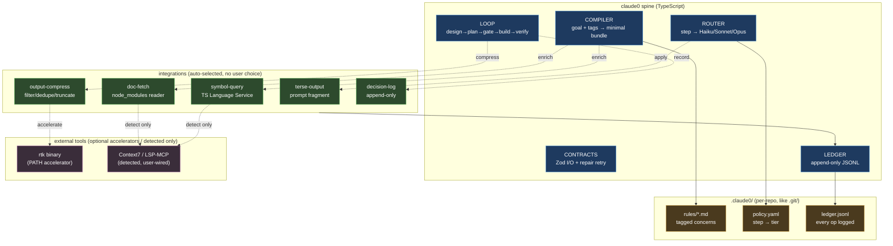
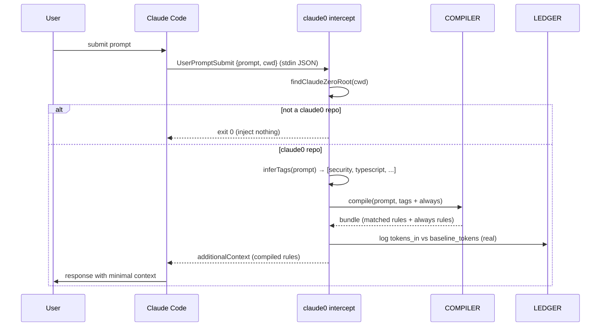
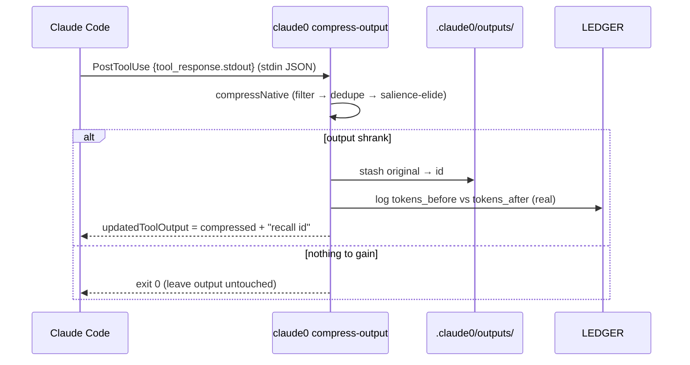
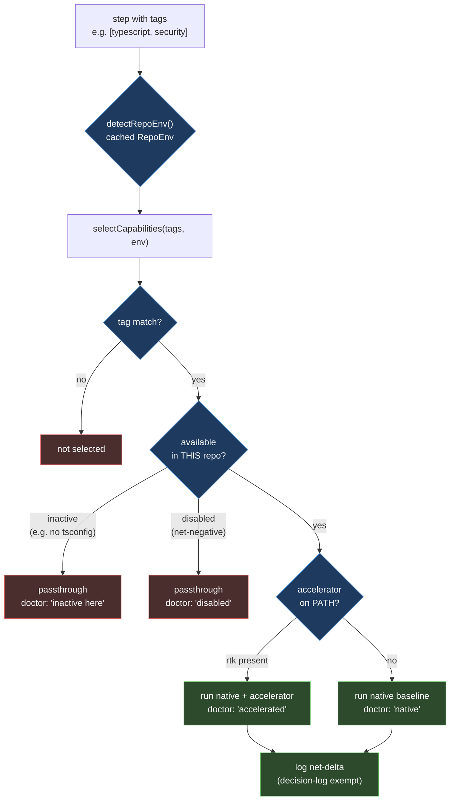

# ClaudeZero Architecture

How the pieces fit: the five-component spine, the integrations layer, and the
per-repo state directory. All diagrams are Mermaid (GitHub renders them natively).

## System overview

The spine owns routing, context compilation, and the ledger. Integrations are
native capabilities that auto-select per step; external tools are accelerators,
never hard dependencies. `.claude0/` is per-repo state, like `.git/`.

## Request data flow — the intercept pipe

This is only honest because `init` first **migrates** the project's `CLAUDE.md`
into tagged rules under `.claude0/rules/` and replaces the file with a stub — so
Claude Code no longer loads the full rule set every turn, and the compiler's
`baseline_tokens` reflects the user's real content rather than something claude0
invented. Sections that match no keyword are tagged `always` and injected on
every prompt, so nothing is silently dropped. The original is backed up and
restored on `uninstall`.

When Claude Code submits a prompt, the `UserPromptSubmit` hook calls
`claude0 intercept`. ClaudeZero compiles minimal context (the matched rules plus
any `always` rules), injects it back, and logs the real input-side token cost. A
non-claude0 repo or any failure exits cleanly without disturbing the prompt.

## Reversible output compression — the PostToolUse pipe

A second hook, `PostToolUse`, runs `claude0 compress-output` on verbose tool
results before they reach the model. Compression is **salience-aware** (error,
failure, assertion, and stack-frame lines are kept wherever they appear) and
**reversible**: the full original is stashed under `.claude0/outputs/<id>.txt`
and the compressed view carries a `claude0 recall <id>` handle. The model gets a
small view by default and can pull the untrimmed original on demand — so shrinking
output never costs information.

Later, `claude0 recall <id>` reads the stashed file back verbatim (ids are
content hashes, validated to stay inside the outputs dir; oldest are pruned).

## Capability selection — automatic, per-repo aware

Capabilities are chosen by step tags and gated by per-repo availability. A
TS-only capability (symbol-query) degrades to "inactive here" in a Python repo
rather than erroring. `claude0 doctor` shows the resulting status.

## Why native-first, accelerator-optional

The efficiency tools people bolt onto Claude Code can't be bundled: `rtk` is a
Rust binary, Context7/LSP are MCP servers invoked inside Claude's tool loop (not
callable from a CLI), others are Python or prompt-skills. So claude0:

- **replicates each capability natively in TypeScript** — always works, zero setup;
- **auto-detects the real tool** and uses it as an accelerator when present (only
  `rtk` is CLI-invokable; MCP tools are surfaced in `doctor` for the user to wire);
- **selects per step automatically** — the user never picks a tool;
- **logs net token delta** per capability, and auto-disables any that stops paying
  for itself (same rolling-window shape as the M2 router auto-demote).

## Ledger as the source of truth

Every operation appends one JSON line to `.claude0/ledger.jsonl`. This makes
savings falsifiable: `baseline_tokens` records what naive full-context would have
cost, so `(baseline - tokens_in)/baseline` is provable per run. M8 adds an optional
`capabilities[]` array per entry (backward-compatible) recording each capability's
`tokens_before`/`tokens_after`/`source`. `claude0 report` shows compiler savings;
`claude0 doctor` shows capability net-delta — kept separate so the two are never
double-counted.
